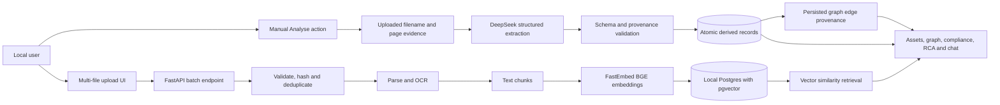

# Architecture

## Invariants

- The backend never reads repository demonstration files.
- Uploading stores, parses, chunks, and embeds documents locally.
- Generated analysis runs only after an explicit user action.
- Exact file content is deduplicated by SHA-256.
- Per-file ingestion is atomic while a batch may partially succeed.
- Generated records must cite an uploaded filename and valid page.
- Verbatim evidence fields must match parsed page text.
- Graph edges are persisted derived records with source node, relation type, target node, confidence, source document, page, evidence snippet, validation status, and validation reason.
- A failed generation does not replace the previous successful derived state.
- Clearing the workspace removes source files, source records, chunk embeddings, derived records, graph edges, and contradictions.

## Code Layers

- `backend/app/main.py`: FastAPI app factory and lifespan startup.
- `backend/app/api/`: route grouping and request/response error translation.
- `backend/app/services/`: ingestion, analysis, graph construction, retrieval-backed intelligence, parsing, embeddings, and DeepSeek calls.
- `backend/app/repositories/`: persistence operations grouped by domain.
- `backend/app/db/`: SQLAlchemy models, local engine/session lifecycle, migrations, raw SQL helpers, and vector search.
- `frontend/app/**/page.tsx`: App Router entrypoints.
- `frontend/app/**/_components/`: route-specific client implementations.
- `frontend/components/`: shared UI and layout components.
- `frontend/lib/`: API client, formatting, types, and browser-side utilities.

## Retrieval

Chat and RCA embed the user query with FastEmbed `BAAI/bge-small-en-v1.5`, retrieve uploaded chunks by pgvector cosine distance, and pass cited chunks to DeepSeek. The embedding model cache is local to the repository by default.
