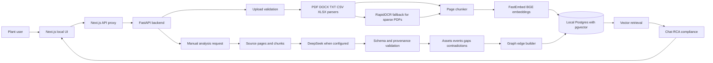

# Architecture Diagram

This document supports the Architecture Diagram deliverable from the ET AI Hackathon 2026 brief.

## High Level Architecture

## Runtime Flow

1. A user uploads evidence through the Documents page.
2. `POST /documents/upload-batch` validates each file by extension, MIME type, signature, size, and binary checks.
3. Accepted files are stored under `backend/data/uploads`.
4. Parsers extract page text and metadata.
5. PDFs with too little embedded text use RapidOCR when `ENABLE_OCR=true`.
6. Parsed pages are chunked and embedded with FastEmbed.
7. Chunks and embeddings are stored in local Postgres with pgvector.
8. The user selects `Analyse workspace`.
9. Generated records are produced only from uploaded source pages.
10. Assets, entities, timeline events, compliance gaps, contradictions, graph edges, and analysis status are persisted.
11. Chat, RCA, and compliance flows retrieve local evidence before calling DeepSeek.

## Invariants

- The backend never reads repository demo files as hidden runtime seed data.
- Uploading stores, parses, chunks, and embeds documents locally.
- Generated analysis runs only after an explicit user action.
- Exact file content is deduplicated by SHA-256.
- Per file ingestion is atomic while a batch may partially succeed.
- Generated records must cite an uploaded filename and valid page where the analysis schema requires provenance.
- Evidence validation checks generated fields against parsed page text.
- Graph edges are persisted with source node, relation type, target node, confidence, source document, page, evidence snippet, validation status, and validation reason.
- A failed generation does not replace the previous successful derived state.
- Clearing the workspace removes local workspace records and tracked upload files.

## Code Layers

| Layer                      | Path                           | Responsibility                                                                         |
| -------------------------- | ------------------------------ | -------------------------------------------------------------------------------------- |
| App factory                | `backend/app/main.py`          | FastAPI setup, CORS, lifespan startup, request logging, exception handling.            |
| API routes                 | `backend/app/api/`             | HTTP route grouping and request/response translation.                                  |
| Services                   | `backend/app/services/`        | Ingestion, parsing, embeddings, analysis, graph, evidence packs, retrieval, LLM calls. |
| Repositories               | `backend/app/repositories/`    | Domain persistence wrappers.                                                           |
| Database                   | `backend/app/db/`              | SQLAlchemy models, sessions, migrations, and database helpers.                         |
| Frontend routes            | `frontend/app/**/page.tsx`     | App Router page entrypoints.                                                           |
| Frontend route components  | `frontend/app/**/_components/` | Route specific client workflows.                                                       |
| Shared frontend components | `frontend/components/`         | Layout, upload, evidence, graph, and UI primitives.                                    |
| Frontend library           | `frontend/lib/`                | API client, types, formatting, SEO, terminal logging.                                  |

## Data Stores

| Store                            | Contents                                                |
| -------------------------------- | ------------------------------------------------------- |
| `backend/data/uploads`           | Local uploaded files tracked by the workspace.          |
| `backend/data/fastembed`         | Default local FastEmbed model cache.                    |
| Postgres table `documents`       | Uploaded document metadata and parsed text.             |
| Postgres table `chunks`          | Parsed chunks and pgvector embeddings.                  |
| Postgres table `entities`        | Generated entities with source document context.        |
| Postgres table `assets`          | Generated assets, risk levels, actions, and provenance. |
| Postgres table `timeline_events` | Generated operational timeline.                         |
| Postgres table `compliance_gaps` | Generated gaps with corrective actions and evidence.    |
| Postgres table `contradictions`  | Conflicting evidence pairs.                             |
| Postgres table `graph_edges`     | Persisted graph relation evidence.                      |
| Postgres table `analysis_runs`   | Analysis status and record counts.                      |

## Retrieval

Chat and RCA use FastEmbed `BAAI/bge-small-en-v1.5` to embed the user query, retrieve uploaded chunks by pgvector similarity, and pass cited chunks to DeepSeek. The selected context count is limited in `backend/app/services/intelligence.py`.

## Deployment Boundary

The current repository is designed for local prototype operation:

- Frontend: `http://localhost:3000`.
- Backend: `http://127.0.0.1:8000`.
- Database: local Postgres.
- External runtime API: DeepSeek only when configured.

No production hosting, container compose, CI pipeline, or public deployment configuration is present.
